# Debug and Repair Engine for AI-Assisted Coding
## Technical and Product Specification

**Version**: 1.0  
**Date**: May 2026  
**Status**: Engineering brief, ready for handoff  
**Scope**: JavaScript, TypeScript, Python; React, Next.js, Node, FastAPI, Supabase, Vercel, Netlify  

---

## Table of Contents

- Section A: Executive Summary
- Section B: Defect Taxonomy
- Section C: Prioritisation Model
- Section D: Detection Architecture
- Section E: Repair Strategy
- Section F: User Experience Flows
- Section G: Evaluation Plan
- Section H: Competitive Landscape
- Section I: Risk Register
- Section J: Six-Month Build Sequence
- Appendix: Sources and Confidence Notes

---

## Section A: Executive Summary

### A.1 The market opportunity

The data on AI-generated code defects is unambiguous and converges from independent sources. Veracode tested 100+ LLMs across 80 coding tasks and found 45% of generated code contained OWASP Top 10 vulnerabilities, a rate that has stayed flat as models improved at syntactic correctness. CodeRabbit analysed 470 real-world pull requests and found AI-co-authored PRs averaged 10.83 issues each versus 6.45 for human-only PRs (1.7x more), with security vulnerabilities at 2.74x and performance defects at nearly 8x the rate. Apiiro's Fortune 50 telemetry showed AI-generated code introducing over 10,000 new security findings per month by June 2025, a 10x increase from December 2024, with shallow syntax errors falling 76% but architectural design flaws rising 153% and privilege escalation paths up 322%. Georgia Tech's Vibe Security Radar tracked 35 CVEs attributable to AI-generated code in March 2026 alone, more than all of 2025 combined, and estimates the true rate is 5x to 10x higher because most AI signatures get stripped from commits.

The pattern is consistent: AI tools reliably generate functional code that passes type checks and unit tests, while shipping a predictable distribution of security, logic, and architectural defects that humans miss in review. Existing tools partially address this. Static analysers (Semgrep, ESLint, Bandit, Ruff, CodeQL) have high precision on syntactic patterns but miss business logic flaws. Pure LLM review approaches show 95% to 100% false positive rates on certain vulnerability classes per Semgrep's own benchmarking. AI code reviewers (CodeRabbit, Greptile, BugBot) catch around 44% to 82% of seeded bugs depending on tool and test conditions. None integrate cleanly with vibecoding apps where users are non-technical, the codebase is generated wholesale, and the user has no mental model of what they shipped.

### A.2 Recommended product shape

A debug and repair engine optimised for the vibecoding context, with three core design commitments:

- **Hybrid detection by default.** Combine deterministic AST and dataflow analysis (high precision, low recall on logic flaws) with LLM reasoning over those findings (validates exploitability, eliminates false positives). This is the architecture Apiiro, Semgrep, and Veracode all converged on independently in late 2025 because pure-LLM and pure-rule approaches both failed in production.
- **Two-persona UX with one engine underneath.** Non-technical founders see plain English explanations, severity-coloured cards, one-click apply with rollback. Experienced developers see CWE references, diff review, audit trails, CI integration. Both share the same defect taxonomy and scoring model.
- **Repair with verification, not repair with hope.** Every auto-applied fix runs against a generated test that proves the defect is gone and an existing or generated regression test that proves nothing else broke. The dominant complaint about current tools is "fixes that introduce new bugs in adjacent code," which empirically happens because LLM-only patch generators have only 24.8% full-correctness rates per the Vul4J Java security study and around 25% to 45% function-level fix rates depending on benchmark.

### A.3 Differentiation against existing tools

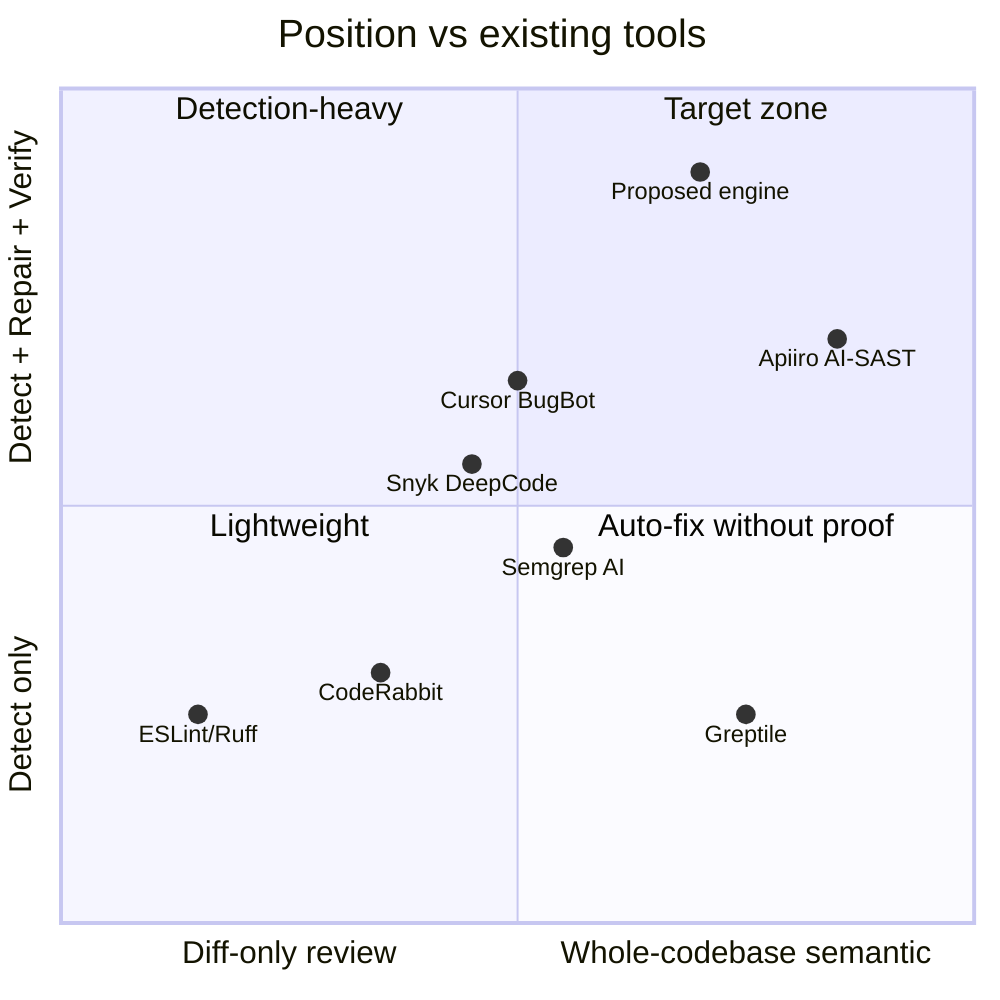

The target zone, whole-codebase semantic understanding plus repair with proof, is genuinely empty for the vibecoding user segment. Apiiro and Snyk operate there for enterprise. Nothing serves founders shipping prototypes.

### A.4 Six-month outcome

By month six, the engine should achieve: 85% precision and 70% recall on the eight-class defect taxonomy validated against a regression set of 500 real AI-generated defects; a documented sub-15% rate of fix-introduces-new-bug regressions; a non-technical user task success rate above 80% on a "ship a working app from a known-broken state" usability test.

---

## Section B: Defect Taxonomy

### B.1 The eight classes

Each class lists representative defects with frequency anchors from primary studies, severity ranges, CWE mappings where applicable, and detection method. Frequency is reported as observed rate in AI-generated code unless noted. Confidence is flagged where evidence is thin.

#### B.1.1 Build and compilation failures

| Defect | Frequency | Severity | CWE | Detection | Repair difficulty |
|---|---|---|---|---|---|
| Hallucinated imports (non-existent modules) | 19.7% of generated packages across 16 LLMs (Spracklen et al, 2024); open-source models 21.7%, commercial 5.2% | Blocker | n/a | Static (resolve imports) | Easy (suggest real package) |
| Type errors in TS not caught by inference | High in cross-file scenarios; LoCoBench shows degradation at 100K+ tokens | Blocker | CWE-704 | TypeScript compiler | Easy (rule-based) |
| Wrong import paths after refactor | Common in multi-file edits; AI PRs show 1.32x fewer testability issues but more cross-file mismatches | Blocker | n/a | Static (path resolution) | Easy |
| Mismatched dependencies in package.json or requirements.txt | Frequent; co-occurs with hallucinated imports | Blocker | n/a | npm/pip dry-run | Easy |
| Syntax errors at boundaries (JSX, template literals) | Apiiro reports 76% drop in syntax errors overall; remaining cases concentrate at language boundaries | Blocker | n/a | Parser | Easy |

Detection: static analysis catches near-100%. Runtime is wasteful here. AI review adds nothing.

#### B.1.2 Runtime and logic errors

| Defect | Frequency | Severity | CWE | Detection | Repair difficulty |
|---|---|---|---|---|---|
| Off-by-one and boundary errors | CodeRabbit reports logic and correctness issues 75% higher in AI PRs | High | CWE-193 | Property tests, AI review | Medium |
| Null/undefined dereference | Common; partially caught by TS strict mode | High | CWE-476 | Static + runtime | Easy to medium |
| Incorrect async/await handling, race conditions | Concurrency issues 2x more common in AI PRs (CodeRabbit) | High | CWE-362 | Hard; requires runtime instrumentation | Hard |
| Wrong control flow (unsafe early return, missing else) | "Unsafe control flow" called out as rising 75%+ in CodeRabbit | High | CWE-670 | AI review with codebase context | Medium |
| State management bugs (stale closures, wrong dep arrays in useEffect) | High in React; pattern-detectable | Medium to high | n/a | ESLint react-hooks plugin | Easy to medium |
| Business logic errors (wrong calculation, wrong comparison) | Algorithm and business logic errors 2x+ in AI PRs (CodeRabbit) | High | n/a | Hard; needs spec or test | Hard |

Detection: split. Pattern-based runtime errors are findable. Business logic errors are the genuine hard problem and where AI review with codebase context outperforms static rules.

#### B.1.3 Security vulnerabilities

| Defect | Frequency | Severity | CWE | Detection | Repair difficulty |
|---|---|---|---|---|---|
| Cross-site scripting | 86% to 88% of relevant samples insecure in Veracode 2025 | Critical | CWE-79, CWE-80 | Semgrep, CodeQL; high precision | Easy (sanitisation) |
| SQL injection | 20% failure rate in Veracode (better than other classes); AI PRs show 2.74x rate vs human (CodeRabbit) | Critical | CWE-89 | Semgrep, Bandit | Easy (parameterise) |
| Hardcoded credentials and secrets | 40% jump in secrets exposure in AI code (Apiiro); 60%+ of vibe-coded apps in Q1 2026 assessment exposed keys | Critical | CWE-798 | TruffleHog, gitleaks; pattern match | Easy (extract to env) |
| Missing authentication on endpoints | Lovable CVE-2025-48757 affected 170+ apps; Base44 had two API endpoints with zero auth | Critical | CWE-306 | Hard; needs route inventory + auth check | Medium |
| Broken access control / IDOR | 49% of high/critical bug bounty findings (Semgrep data); Lovable April 2026 incident exposed every user's project via this | Critical | CWE-639, CWE-285 | Semgrep AI: 1.9x recall vs Claude Code alone | Hard |
| Insecure direct object references | See above; Semgrep AI hybrid detection at 61% precision vs Claude Code alone at 22% | Critical | CWE-639 | Hybrid AST+LLM | Hard |
| Server-side request forgery | Tracked in Georgia Tech Vibe Security Radar | Critical | CWE-918 | Semgrep, CodeQL | Medium |
| Command injection | CWE-78 was top weakness in Copilot study (Fu et al 2024) | Critical | CWE-78 | Semgrep, Bandit | Easy (escape or replace exec) |
| Insufficiently random values | CWE-330 most frequent in Copilot empirical study | High | CWE-330 | Static rules | Easy |
| Path traversal | Standard scanner coverage | High | CWE-22 | Semgrep | Easy |
| Weak cryptography | Veracode flags as one of the top four CWE categories | High | CWE-327 | Bandit, Semgrep | Easy |
| Log injection | 88% of relevant samples insecure (Veracode) | Medium | CWE-117 | Semgrep | Easy |
| Disabled or missing Row Level Security (Supabase) | Lovable, Base44, multiple incidents documented in 2025 to 2026 | Critical | CWE-285 | Custom rules over migration files | Medium |
| Slopsquatting (malicious package matching hallucinated name) | 19.7% hallucination rate; 43% of hallucinations repeat across all 10 queries of the same prompt | Critical | CWE-1357 | Verify package against registry, check publish date and stars | Easy (block install) |
| Outdated dependencies with known CVEs | Models trained on 6+ month old snapshots routinely recommend vulnerable versions | Variable | n/a | Snyk, npm audit, Dependabot | Easy |

Detection: deterministic for syntactic flaws (XSS, SQLi, secrets, command injection); hybrid AST+LLM essential for IDOR, broken access control, missing auth, and RLS misconfiguration. Pure LLM detection on these is unreliable: Semgrep documented 95% to 100% false positive rates for SQL injection detection from pure-LLM approaches.

#### B.1.4 API and data contract errors

| Defect | Frequency | Severity | CWE | Detection | Repair difficulty |
|---|---|---|---|---|---|
| Hallucinated API endpoints (non-existent) | High; sibling phenomenon to package hallucination | Blocker | n/a | Differential testing against OpenAPI spec | Medium |
| Wrong HTTP method or status code | Common pattern in AI-generated handlers | Medium | n/a | OpenAPI conformance test | Easy |
| Missing or inconsistent error responses | "Error handling and exception-path gaps nearly 2x more common" in AI PRs | High | CWE-755 | Static (count handlers); AI review for completeness | Medium |
| Schema drift between client and server | Common in full-stack AI generation (Lovable, Bolt, Cursor full-app generation) | High | n/a | TypeScript type-checking across boundary, OpenAPI | Medium |
| Missing input validation | 10x increase in "APIs missing authorization and input validation" in AI repos (Apiiro, Feb 2025) | Critical | CWE-20 | Pattern match for input handlers without validation | Medium |
| Wrong request body parsing | Pattern detectable | Medium | n/a | Static | Easy |
| CORS misconfiguration | Common AI default of `*` | High | CWE-942 | Static rules | Easy |

Detection: requires either an OpenAPI spec (often missing in vibecoded apps) or differential testing where the engine generates probe requests and compares behaviour to spec. AI review adds value for completeness checks.

#### B.1.5 Authentication and authorisation defects

Treated separately from B.1.3 because the failure mode is design-level, not pattern-level. Apiiro documented a 322% increase in privilege escalation paths and 153% increase in design flaws in AI-generated code. These are the highest-impact and hardest to detect class.

| Defect | Frequency | Severity | CWE | Detection | Repair difficulty |
|---|---|---|---|---|---|
| Client-side-only auth enforcement | Enrichlead shut down because of this exact pattern | Critical | CWE-602 | AST traversal: any auth check in client bundle | Medium |
| Missing server-side session validation | Common in AI handlers that copy a "logged in" boolean | Critical | CWE-287 | Cross-file: every API route checks session | Medium |
| JWT signature not verified | Common AI omission | Critical | CWE-345 | Pattern: jwt.decode without jwt.verify | Easy |
| OAuth state parameter missing | Common | High | CWE-352 | Pattern match | Easy |
| Insecure password storage (plain text, weak hash) | "Improper password handling" called out specifically in CodeRabbit | Critical | CWE-256, CWE-916 | Static | Easy |
| Privilege escalation through missing role check | Apiiro: 322% increase in AI code | Critical | CWE-269 | Hybrid AST+LLM with codebase graph | Hard |
| Session fixation | Detectable | High | CWE-384 | Static | Medium |
| Insecure session cookies (no Secure, no HttpOnly) | Frequent | Medium | CWE-614, CWE-1004 | Pattern | Easy |
| Missing rate limiting on auth endpoints | Common | High | CWE-307 | Cross-file route inventory | Medium |

Detection: this class needs a route inventory and an auth model the engine builds during indexing, then checks every authenticated path against it. Pure pattern matching misses most cases.

#### B.1.6 Deployment, packaging, and CI errors

| Defect | Frequency | Severity | CWE | Detection | Repair difficulty |
|---|---|---|---|---|---|
| Missing or wrong environment variables | Common cause of ship-and-break | Blocker | n/a | Compare .env.example to code references | Easy |
| Incorrect build command in vercel.json or Dockerfile | Frequent | Blocker | n/a | Build dry-run | Medium |
| Missing build steps (postbuild, migrations) | Common AI omission | High | n/a | Pattern + dry-run | Medium |
| Insecure default config (debug mode in production) | "Misconfigurations 75% more frequent" in AI PRs (CodeRabbit) | High | CWE-489, CWE-16 | Pattern | Easy |
| Exposed secrets in client bundle | Webpack/Vite picks up env vars without VITE_PUBLIC_ prefix | Critical | CWE-200 | Bundle inspection | Medium |
| Missing CI checks | Common in AI-generated repos | Medium | n/a | Repo inventory | Easy |
| Wrong Node/Python version pin | Frequent | Medium | n/a | Static | Easy |

Detection: half static, half requires actually running the build. A sandboxed build is part of the architecture for this class.

#### B.1.7 Performance and scalability issues

CodeRabbit found performance issues nearly 8x more common in AI PRs, the largest delta of any category. Apiiro called out shallow gains being offset by deeper architectural performance flaws.

| Defect | Frequency | Severity | CWE | Detection | Repair difficulty |
|---|---|---|---|---|---|
| N+1 queries in ORMs | Very common AI pattern | High | n/a | AST analysis of loop+query patterns | Medium |
| Missing indices on filtered columns | Common; AI doesn't propose migrations for indices | High | n/a | Schema + query analysis | Medium |
| Excessive I/O in loops | "Excessive I/O appears nearly 8x more often" (CodeRabbit) | High | n/a | AST | Medium |
| Synchronous calls blocking event loop | Frequent in Node | High | n/a | Static | Easy |
| Memory leaks (unclosed streams, growing caches) | Hard to spot | High | CWE-401 | Runtime profiling | Hard |
| Inefficient algorithms (O(n^2) where O(n) exists) | Common | Medium to high | n/a | AI review | Medium |
| Missing pagination | Common AI pattern; "return everything" | High | n/a | Endpoint analysis | Medium |
| No caching where obvious | Common | Medium | n/a | AI review | Medium |
| Bundle size bloat (importing whole libraries) | Common; "AI tends to reach for a package when five lines would do" | Medium | n/a | Bundle analyser | Easy |

Detection: loop and query patterns are AST-tractable. Memory leaks and algorithmic complexity require runtime profiling or AI review.

#### B.1.8 Maintainability and readability issues

CodeRabbit: "Code readability problems increase more than 3x" in AI PRs. Naming inconsistencies nearly 2x, formatting issues 2.66x. Lower severity but high volume; matters for the experienced-developer persona, less for the vibecoding founder.

| Defect | Frequency | Severity | Detection | Repair difficulty |
|---|---|---|---|---|
| Inconsistent naming (camelCase vs snake_case mixed) | 2x more common in AI code | Low | ESLint, Ruff | Easy (codemod) |
| Dead code (unreachable, unused imports) | Common | Low | ESLint, Ruff | Easy |
| Duplicate code (4x increase, Naples 2025 study) | High volume | Low to medium | jscpd, Sonar | Medium |
| Overly long functions | Common in AI generation | Low | Cyclomatic complexity tools | Medium |
| Magic numbers and strings | Common | Low | ESLint | Easy |
| Missing or incorrect comments | 1.32x more testability issues in AI per Naples study | Low | AI review | Easy |
| Inconsistent error message format | Common | Low | AI review | Easy |
| Architectural drift (subtle design changes that break invariants) | 153% increase in design flaws (Apiiro) | High | Hybrid; needs codebase model | Hard |

Detection: linters cover the cheap wins. Architectural drift is the only entry here that matters for safety and needs the same hybrid approach as B.1.5.

### B.2 Frequency summary

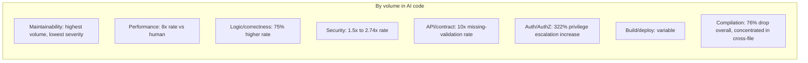

### B.3 Confidence notes

- Veracode 45% figure: high confidence, methodology fully disclosed, replicated across 100+ models.
- CodeRabbit 1.7x figure: medium-high confidence. Methodology limitation acknowledged: cannot verify which PRs labeled "human-only" actually were exclusively human-authored. The Naples August 2025 paper on 500K+ samples reached similar directional conclusions.
- Apiiro 10x figure: medium confidence. Disputed by Contrast Security CTO (other studies show 10% to negative impacts). Apiiro counters that scope (Fortune 50, full SDLC) explains the gap. Treat as upper bound for enterprise environments, less reliable for prototype-stage code.
- METR slowdown finding (19% slower with AI): single RCT, n=16, experienced developers in mature repos. Should not be extrapolated to greenfield vibecoding. METR's August 2025 follow-up was abandoned because of self-selection bias.
- Georgia Tech Vibe Security Radar 35 CVEs in March 2026: lower bound. Tool relies on commit metadata signatures; many AI tools (Copilot inline) leave no trace. Researchers estimate 5x to 10x undercounting.

---

## Section C: Prioritisation Model

### C.1 Why a custom model is needed

CVSS is built for vulnerability severity in a deployed system. It does not handle defect classes outside CVE-track issues (logic errors, performance, build failures). The engine needs one score that ranks across all eight classes.

### C.2 The PRIORITY score

```
PRIORITY = (S * B * C * U) / D
```

Where:

- **S** = Severity (0 to 10). CVSS-aligned for security defects, custom rubric for non-security.
- **B** = Blast radius multiplier (1.0 to 3.0). How much of the system breaks if this defect fires.
- **C** = Confidence (0.0 to 1.0). How sure the engine is the defect is real (not false positive).
- **U** = User context multiplier (0.5 to 2.0). Adjusts for whether the user is a founder shipping a prototype or a team running production.
- **D** = Detection-to-fix difficulty (1.0 to 3.0). Higher means harder to fix; pushes simple high-severity issues up.

### C.3 Component definitions

#### C.3.1 Severity (S)

| Defect class | Default S |
|---|---|
| Critical security (auth bypass, IDOR, hardcoded prod secret, RCE) | 9 to 10 |
| High security (XSS, SQLi, weak crypto, missing input validation) | 7 to 8 |
| Build/compile blocker | 8 (it stops everything) |
| Runtime crash on common path | 8 |
| Business logic bug affecting paid features or data correctness | 7 |
| Performance: N+1, blocking I/O on hot path | 5 to 6 |
| Maintainability: naming, dead code | 1 to 2 |

#### C.3.2 Blast radius (B)

| Scope | B |
|---|---|
| Whole system down (build broken, prod DB at risk) | 3.0 |
| All users affected (auth broken, public endpoint exposed) | 2.5 |
| Subset of users affected (specific feature, specific role) | 2.0 |
| Single page or component | 1.5 |
| Internal-only (dev tooling, build pipeline) | 1.0 |

Determined from the codebase graph: which routes touch this code, which user roles can reach those routes, what data is at the affected nodes.

#### C.3.3 Confidence (C)

| Detection method | C |
|---|---|
| Compiler error (deterministic) | 1.0 |
| Static analysis with high-precision rule (e.g., parameterised query rule) | 0.9 |
| Hybrid AST+LLM with confirmed exploit trace | 0.85 |
| Pure pattern match without exploitability proof | 0.6 |
| LLM-only finding without static signal | 0.3 to 0.5 |

This is the lever that fights false positives. Low-confidence findings get downranked, never silently dropped.

#### C.3.4 User context (U)

Two modes selectable at install time, modifiable per-project:

- **Founder mode** (default for vibecoding apps):
  - Critical security: U = 2.0 (their app will get scanned by attackers within hours of going live; the Lovable, Tea, Base44 incidents all happened on day-of-launch)
  - Build/runtime blockers: U = 2.0
  - Performance: U = 0.7 (premature optimisation for a prototype)
  - Maintainability: U = 0.5
- **Team mode**:
  - Critical security: U = 1.5
  - Build/runtime blockers: U = 1.5
  - Performance: U = 1.2
  - Maintainability: U = 1.0

#### C.3.5 Difficulty (D)

| Fix type | D |
|---|---|
| Codemod or one-line change | 1.0 |
| Refactor within one file | 1.5 |
| Cross-file refactor | 2.0 |
| Architectural change (auth model, schema, multiple services) | 3.0 |

Higher D pushes the priority down because the user needs to budget time. A trivial high-severity fix (D=1, S=9) ranks higher than a hard high-severity fix (D=3, S=9), correctly: ship the easy wins first.

### C.4 Worked example

Lovable-style missing RLS on a Supabase table containing user PII, founder mode:

- S = 9 (critical security, real-world exploit)
- B = 2.5 (all users)
- C = 0.85 (hybrid detection, clear)
- U = 2.0 (founder mode, security)
- D = 1.5 (one migration file, well-scoped)

PRIORITY = (9 × 2.5 × 0.85 × 2.0) / 1.5 = **25.5**

A naming inconsistency in the same project:

- S = 1, B = 1.0, C = 0.95, U = 0.5, D = 1.0
- PRIORITY = 0.475

The 50x ratio reflects that one of these will get someone's data leaked and the other is a code style nit.

### C.5 Banding

| Score | Band | Treatment |
|---|---|---|
| ≥ 20 | Critical | Block deploy. Surface modal, not list item. |
| 10 to 19 | High | Surface prominently, recommend fix before ship |
| 5 to 9 | Medium | Visible in dashboard, sort by score |
| 1 to 4 | Low | Aggregate ("12 maintainability issues") |
| < 1 | Info | Hide unless user opts in |

---

## Section D: Detection Architecture

### D.1 Architecture overview

The engine uses a layered pipeline. Each layer is independently buildable, testable, and replaceable. This matches what Apiiro, Semgrep, and Veracode converged on independently in late 2025.

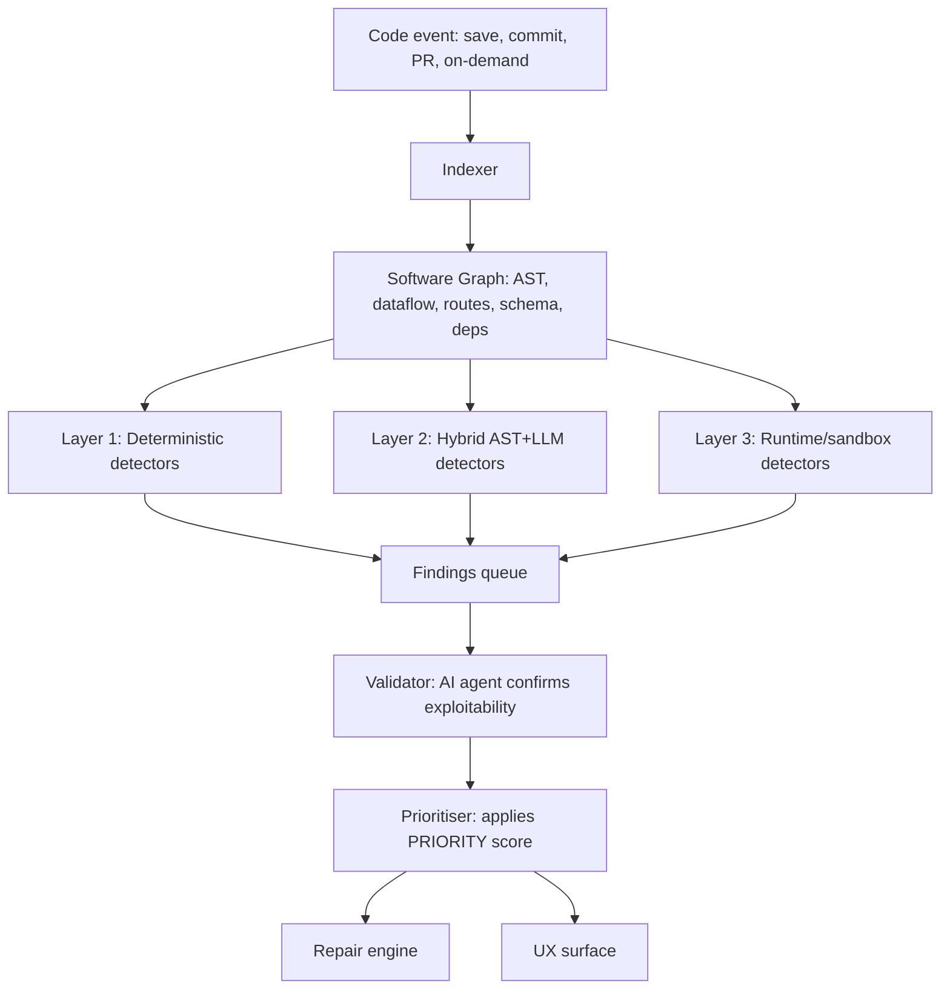

### D.2 Layer-by-layer build, buy, integrate decisions

#### D.2.1 The indexer and software graph

**Build.** This is the differentiator. Off-the-shelf indexers (tree-sitter, ctags) give AST but not the full graph: routes, schemas, auth model, dataflow across files. Apiiro's Deep Code Analysis is their patented moat for the same reason. For a vibecoding-targeted tool the graph needs:

- **AST** per file (tree-sitter for JS/TS/Python; covers all four target languages plus most config formats).
- **Symbol resolution** across files. Use the language server protocol where possible (TypeScript Language Server, Pyright) to avoid reimplementing.
- **Route inventory.** Detect Express routers, Next.js app router and pages, FastAPI routers, Supabase RPC. Each route gets metadata: path, methods, handlers, middleware chain, auth applied.
- **Schema graph.** Parse Prisma schemas, Drizzle, SQLAlchemy, Supabase migrations. Output: tables, columns, RLS policies, foreign keys.
- **Dataflow.** Trace user input from request handlers to sinks (DB queries, file writes, system calls, HTML rendering). This is the primary input to security detectors.
- **Auth model.** Identify authentication points (JWT verify, session check, OAuth callback) and authorisation checks (role checks, ownership checks). Build a graph: route → required auth → required role → resource accessed.

Estimated effort: 6 to 10 engineering weeks for first-pass JS/TS/Python coverage. This is the hardest single piece. Cut scope by initially supporting only the named frameworks (React, Next.js, Node, FastAPI, Supabase, Vercel, Netlify) instead of attempting framework-agnostic coverage.

#### D.2.2 Layer 1: Deterministic detectors

**Integrate (mostly).** The right move is to integrate proven scanners and avoid reinventing.

| Need | Tool | Why |
|---|---|---|
| JS/TS lint and react-hooks correctness | ESLint + typescript-eslint + react-hooks plugin | Battle-tested, fast, covers a lot of B.1.2 and B.1.8 |
| Python style and bugs | Ruff | Fast, replaces flake8/isort/pyupgrade |
| Python security | Bandit | Standard, covers many B.1.3 cases |
| Multi-language semantic patterns | Semgrep OSS | Best ratio of precision to flexibility; runs custom YAML rules; OWASP rule pack covers many B.1.3 cases |
| Secret scanning | gitleaks or trufflehog | Mature pattern + entropy detection |
| Dependency CVE | npm audit, pip-audit, OSV-scanner | Free; covers B.1.6 outdated dependencies |
| Slopsquatting check | Custom: query npm/PyPI registry, check publish date < 60 days, downloads < 1000, no source repo, against AI hallucination database from Spracklen et al's 205,474 known names | Specific to this engine's value |

**Build:** custom Semgrep rules for the framework-specific patterns Semgrep doesn't ship by default. Examples:

- Supabase RLS missing on table containing PII columns
- Next.js API route handler without `getServerSession` or equivalent
- FastAPI route without dependency injection of authenticated user
- Client-side authorisation check (e.g., `if (user.role === 'admin')` in a `.tsx` file gated to render only)
- Client-bundled environment variable holding what looks like a secret

Estimated rule set: 80 to 120 custom rules to ship at launch, growing.

#### D.2.3 Layer 2: Hybrid AST+LLM detectors

**Build.** This is the second differentiator. The Semgrep AI launch in November 2025 demonstrated the pattern: AST scan finds candidate locations, LLM validates whether the candidate is exploitable in context. Their numbers: 61% precision vs Claude Code alone at 22% on IDOR detection, 1.9x recall improvement, 90% better recall when LLM uses Semgrep as a tool. Apiiro hit similar numbers with their AI-SAST.

The pattern that works:

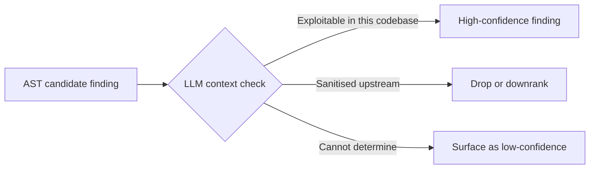

Target defect classes for Layer 2:

- IDOR / broken access control (B.1.5)
- Missing auth on routes (B.1.5)
- Privilege escalation paths (B.1.5)
- Architectural drift (B.1.8)
- Business logic errors (B.1.2)
- API contract conformance (B.1.4)
- Performance anti-patterns requiring context (B.1.7)

Implementation notes:

- Use the strongest available reasoning model for the validator (Opus-class or equivalent). The Veracode October 2025 update showed top reasoning models at 70%+ security pass rates while non-reasoning variants dropped to 52%.
- Pass the validator: the candidate location, ±50 lines of context, the relevant subgraph from the software graph (callers, callees, schema for tables touched), and the rule's plain-English description.
- Validator output is structured: `{is_real, confidence, exploit_path, suggested_fix_strategy}`.
- Cache aggressively. Re-validate only on code change to the affected slice.

#### D.2.4 Layer 3: Runtime and sandbox detectors

**Build.** Many AI defects only surface at runtime. Lovable's RLS bug looked like working code; only an actual unauthenticated request showed it.

Components:

- **Build sandbox.** Container that runs `npm install && npm run build` (or pip equivalent). Catches B.1.6 fully and many B.1.1 cases.
- **Probe runner.** For every detected route, send synthesised probe requests: unauthenticated, wrong-role, malformed input, oversized payload. Record responses. Layer 2 validator interprets results. This is what would have caught the Lovable, Base44, and Tea incidents in seconds.
- **Test generator.** Use AI to generate tests targeting suspect findings (every IDOR candidate gets an auto-generated test that logs in as user A, requests user B's resource, asserts 403). Run them.
- **Property-based fuzzer.** For pure functions, generate property-based tests via Hypothesis (Python) or fast-check (JS).

Sandbox tech: Firecracker microVMs, gVisor containers, or e2b/Modal. Decision driver is per-customer isolation cost vs latency.

#### D.2.5 Layer 4: Validator (single AI agent)

The validator deduplicates, ranks, and filters across all detector outputs before they reach the prioritiser. It exists because raw detector output has duplicates (the same XSS spot might fire from ESLint, Semgrep, and a custom rule), false positives, and inconsistent confidence.

Behaviour:

- Group findings by location (file + line range + defect class).
- For each group, decide: real or false positive. Use the same Layer 2 model.
- Output one canonical finding per group with merged evidence.

Semgrep's Assistant achieved 96% agreement with human security researchers on triage decisions using this pattern. That is the target.

### D.3 Architecture trade-offs

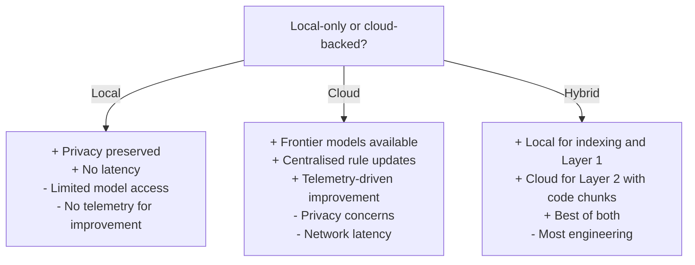

**Recommendation: hybrid.** Indexing and Layer 1 detection run locally (low latency, no code leaves the machine for Layer 1). Layer 2 sends only the relevant code slice plus rule context to the cloud. Build sandbox runs in cloud microVMs.

**Multi-agent vs single-agent:** the planner-detector-fixer-verifier pattern that became fashionable in 2024 is excessive here. Apiiro and Semgrep both ship simpler architectures: deterministic detectors as tools, one validator agent, one repair agent. Single-agent-per-stage with clean handoffs beats N-agent orchestration on latency, cost, and debuggability.

**Caching and incremental analysis:** essential for any codebase over 10K LOC. Cache:
- AST per file, invalidated by file mtime
- Software graph, partially invalidated by changed file's import closure
- Layer 1 findings, invalidated by file change
- Layer 2 validations, invalidated when the candidate location or its callers change

Greptile's whole-codebase indexing approach is the right precedent. Their value is they index once and reuse; a debug tool needs the same.

### D.4 Architecture diagram with build-buy-integrate annotated

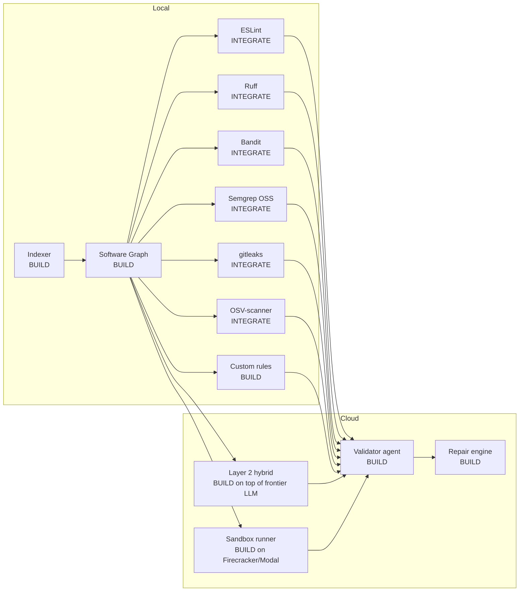

---

## Section E: Repair Strategy

### E.1 The dominant problem: fixes that introduce new bugs

This is the failure mode that kills trust in repair tools. Empirical evidence:

- Vul4J replication study (Al-Maamari 2026): 319 LLM-generated security patches across 64 Java vulnerabilities. Only 24.8% achieved full correctness. 51.4% failed both security and functionality. Mean security score 0.251, mean functionality preservation 0.832: LLMs preserve what worked but rarely fix what was broken.
- The Vul4J replication with deliberate fault localisation offsets showed that much LLM repair "success" is memorised reproduction of public fixes; tiny localisation errors collapse repair rates, suggesting brittle generalisation.
- Function-level APR with Defects4J: SREPAIR fixed 300 single-function bugs (best of class), but the dataset comprises clean isolated bugs. Real AI-generated defects are rarely so isolated.
- SWE-bench Verified scores look impressive (78%+) but SWE-ABS and UTBoost both showed 20% to 25% of "passing" patches are semantically incorrect; they pass weak tests. Real fix rate is closer to 60%.
- Regression repair with LLMs: only 1.8x improvement over best non-LLM techniques on RegMiner4APR, and that benchmark explicitly tests the exact failure mode (fixes that broke something else).

### E.2 The repair pyramid

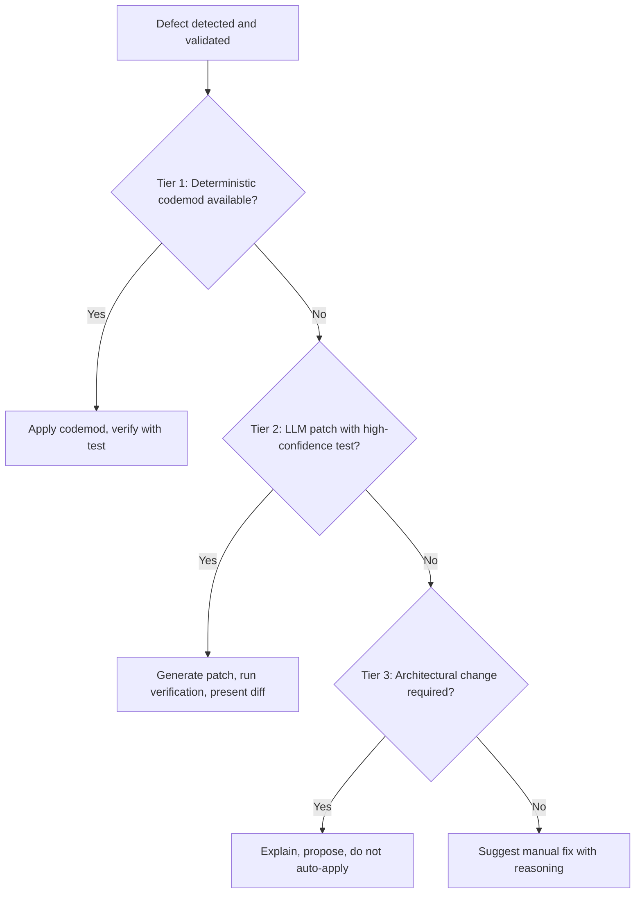

### E.3 Tier 1: Deterministic rule-based fixes

For defect classes where the fix is mechanical, do not use an LLM. Codemods are faster, cheaper, and have zero regression risk if the rule is correct.

| Defect | Codemod |
|---|---|
| Missing parameterised query | Replace string concat with parameterised binding (Bandit/Semgrep autofix) |
| Hardcoded secret | Extract to env var, replace with `process.env.X`, add to `.env.example` |
| Missing HttpOnly/Secure on session cookie | Add flags to cookie config |
| jwt.decode without verify | Replace with jwt.verify with secret reference |
| Bundle env var leak | Move to server-side, generate API endpoint stub |
| Missing input validation in Express route | Insert zod or Joi schema check at entry |
| Naming inconsistency | jscodeshift codemod |
| Dead code | ESLint --fix, Ruff --fix |
| Hallucinated package | Replace with closest real package, prompt user to confirm |
| Missing index on filtered column | Generate migration |

Tools to integrate: jscodeshift for JS/TS, libcst or rope for Python, native ESLint/Ruff autofix where it exists. Cover roughly 30% of detected defects with this tier.

### E.4 Tier 2: LLM patch with verification loop

For defects where the fix depends on context but the scope is local, use LLM patch generation gated by tests. The verification loop is non-negotiable.

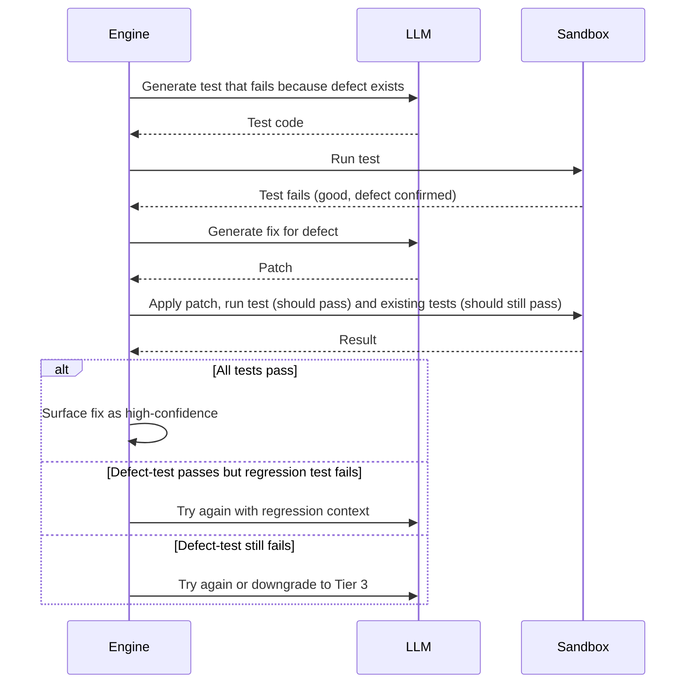

This is a test-driven repair loop. The order matters: generate the failing test first to prove the defect, generate the fix second. If the fix doesn't pass the failing test, the loop iterates with the failure information. If the fix passes the new test but breaks an existing test, the loop iterates with the regression information. Cap at 3 attempts; beyond that, downgrade to Tier 3.

This pattern eliminates the largest failure mode: LLM-generated patches that look right and pass type-check but don't actually fix the bug or break adjacent code. Without a test that proves the bug, the LLM cannot self-verify.

### E.5 Tier 3: Architectural changes (suggest, do not apply)

Some defects require changes the engine should never auto-apply:

- Auth model changes (introducing roles, refactoring session handling)
- Schema changes that affect existing data
- Cross-service API contract changes
- Dependency upgrades that span major versions

For these, the engine produces:
- Plain-English explanation of why the change is needed
- Proposed diff for the user to review and apply manually
- Migration plan if data is affected
- Tests that should pass after the change

Apply automatically only on explicit user click-through with a confirmation modal showing the full diff and impact summary.

### E.6 Diff review patterns

The diff is the primary trust-building surface. Patterns that work, drawn from CodeRabbit, Cursor, Greptile feedback:

- **Show only what changed.** Truncate unchanged context.
- **Annotate the why.** Each hunk has a one-sentence explanation.
- **Group hunks by intent.** Keep "fix the bug" hunks separate from "and while I was here, I cleaned up X" hunks. Users hate AI scope-creep in diffs.
- **Show the test alongside.** The test that proves the fix is part of the diff.
- **Confidence label.** "High confidence: test passes, no regression" vs "Medium: tests pass but I touched 3 unrelated files."
- **One-click revert.** At the patch level, not the file level.

### E.7 Rollback and isolation

Every applied fix is reversible. Two layers of safety:

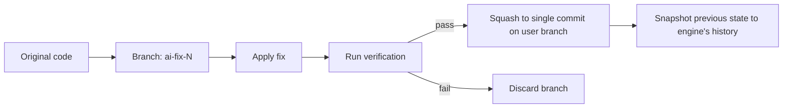

- **Git-level isolation.** Every fix is applied on a fresh branch; the user's working branch is touched only after verification. The Replit incident (production DB wiped) was the cautionary tale: the agent had write access to live infrastructure with no isolation.
- **Engine-level history.** The engine maintains its own history of applied fixes independent of the user's git, so even a force-push doesn't lose the audit trail.
- **Production protection.** For users with production deploys connected (Vercel, Netlify), apply fixes only to preview branches by default, never to main without explicit click-through.
- **Database protection.** Never run schema migrations, never run `DROP`, never run anything that touches a production data store without an explicit, modal, typed-confirmation user step. The Lemkin/Replit incident, Gemini CLI deletion incident, Amazon outage all hinged on this.

### E.8 Failure modes documented

| Failure mode | Mitigation |
|---|---|
| LLM patch passes generated test but doesn't actually fix the underlying issue | Mutation testing: mutate the patched code; if the test still passes, it was a vacuous test |
| Patch fixes the spot but breaks adjacent code | Always run full existing test suite before presenting fix |
| Patch works in isolation but breaks at integration | Sandbox build + smoke probe before presenting |
| User accepts patch, regrets it later | One-click rollback within 7 days; engine keeps history |
| Patch contains hallucinated API call | Validator agent checks every introduced symbol against the actual codebase + dependency manifest |
| Fix removes a security check the user didn't intend to remove | Diff diff: highlight any deletion of code matching auth, validation, or sanitisation patterns; never auto-apply if found |
| Series of fixes drift the codebase architecturally | Track cumulative architectural metrics (function depth, file count, cyclomatic complexity); alert if a single session's changes drift 2 standard deviations from baseline |

The "fix removes a security check" mitigation was prompted by Greptile's documented case study: a refactor PR that removed a 23-line SUPER_ADMIN authorisation check while looking benign. Code that touches security boundaries needs structurally different treatment from code that doesn't.

---

## Section F: User Experience Flows

### F.1 The two personas

| Persona | Founder Fiona | Developer Dan |
|---|---|---|
| Background | Non-technical or lightly technical; vibecoded the app | 5+ years professional, uses AI to accelerate |
| Mental model | "I described what I want, the AI built it" | "I know the codebase, AI is a tool" |
| Wants | Confidence the app works and is safe to share | Faster review, fewer false positives, audit trail |
| Tolerates | Some friction if it explains why | Almost zero false positives; will turn off the tool |
| Reads diffs | Rarely; relies on tool judgment | Always |
| Uses CWE numbers | No | Yes |

The same engine serves both. The difference is the surface: which UI mode loads.

### F.2 Founder flow: "Check my app"

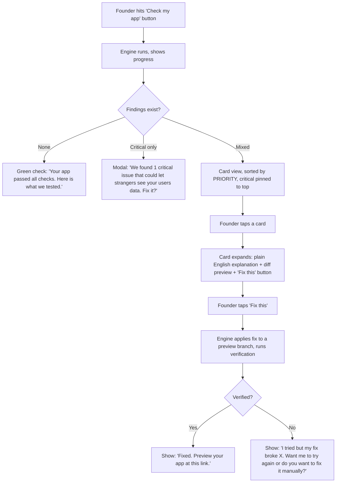

**Critical UI principles for founders:**

- **No CWE numbers in the default view.** Show "Strangers can see your users' data" not "CWE-285 Improper Authorization." Numbers go in an "advanced" toggle.
- **No code by default.** The card shows the impact: "If someone visits this URL pattern, they will get other users' email addresses." Code is one tap away.
- **One action per card.** "Fix this" is the verb. Not "Apply patch" or "Generate suggestion."
- **Verification visible.** When a fix is applied, the founder sees what was tested: "Logged in as a user, tried to access another user's data, got blocked. Confirmed fixed."
- **Block deploy on critical.** If a critical-band defect is unresolved and the user clicks Deploy, intercept with a modal: "This app has a critical security issue. If you ship now, anyone can access user data. Continue anyway?" with the unsafe option requiring typed confirmation. The Tea, Lovable, Base44 incidents all happened on day-of-launch; the fix is to not let it ship.

### F.3 Developer flow: PR-time review

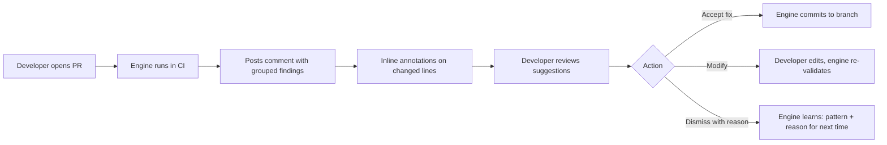

**Critical UI principles for developers:**

- **Group by file, then by class, then by severity.** Long lists are unreadable; the only navigable surface is collapsible sections.
- **Show CWE, severity, confidence.** Every finding labelled.
- **Differential mode.** Default to "issues introduced in this PR" not "all issues in the codebase." Greptile and CodeRabbit both default this way; users complain when they don't.
- **Suppress with reason.** When a developer dismisses a finding, capture the reason (false positive / accepted risk / test code / etc). Use this to retrain confidence scoring.
- **CLI parity.** Everything in the PR comment is reproducible by `engine check --since main`. Developers will run this locally.
- **Editor integration.** VSCode plugin shows current-file findings as squiggles, identical to ESLint. CodeRabbit's December 2025 IDE expansion was a direct response to "we want feedback before PR time."

### F.4 What works in existing tools (and what to copy)

| Pattern | Source | Adopt |
|---|---|---|
| PR comment with summary at top, findings grouped below | CodeRabbit | Yes |
| One-click apply on suggestions | CodeRabbit IDE, Cursor BugBot | Yes |
| Codebase-aware context (graph indexing) | Greptile | Yes |
| Confidence label on findings | Apiiro | Yes |
| Custom rule files in repo | Greptile, CodeRabbit (.coderabbit.yaml) | Yes |
| Block merge on critical | Snyk, GitHub native | Yes |
| Educational why explanations | Snyk | Yes for founder mode, optional for dev mode |

### F.5 What people complain about (and what to avoid)

From public reviews, Reddit threads, and Register/HelpNet coverage:

- **Comment volume.** Greptile catches 82% of seeded bugs but at the cost of more noise; CodeRabbit catches 44% with fewer extraneous comments. Developers get fatigued and disable tools that comment on every detail. Mitigation: aggressive validator-stage filtering, configurable noise threshold.
- **AI fixing typos but not bugs.** Apiiro framing. Implication: don't let auto-fix scope-creep into style cleanup when the user asked for a security fix.
- **Fixes that introduce new bugs in adjacent code.** Most-cited complaint. Mitigation is Section E's verification loop; this is the differentiator.
- **Tool slowing down PR cycle.** AI review can add 40 to 60% to review time if naively configured. Mitigation: run async, post results when ready, do not block the developer.
- **False positives killing trust.** Pure-LLM tools with 95%+ FPRs on classes like SQL injection (per Semgrep benchmark). Mitigation: hybrid detection, confidence-gated surfacing.

### F.6 Integration points

| Surface | When | Who |
|---|---|---|
| Editor (squiggles) | Real-time on save | Developer |
| Pre-commit hook | Before commit | Developer |
| PR comment | On PR open and update | Developer |
| CI gate | Block deploy if critical | Both |
| Standalone web app | On-demand check | Founder |
| Dashboard | Periodic review | Both |
| Slack/email digest | Weekly summary | Both |

The vibecoding angle: most founders are inside a host environment (Lovable, Bolt, Cursor, Replit). The integration that matters is the host's "Deploy" or "Publish" button: intercept that. Everything else is secondary.

---

## Section G: Evaluation Plan

### G.1 What to measure

| Metric | Target at v1 | How measured |
|---|---|---|
| Precision (true positives / surfaced findings) | ≥ 85% on critical band, ≥ 75% overall | Manual audit of 200 random findings/quarter |
| Recall (defects found / defects present) | ≥ 70% on critical band | Run engine on regression set (G.3) |
| False positive rate per 1000 LOC | ≤ 5 | Run on clean human-written reference codebases |
| Mean time to fix (detection to verified resolution) | ≤ 2 minutes for Tier 1, ≤ 10 minutes for Tier 2 | Telemetry |
| Regression rate (fixes that introduce new defects) | ≤ 10% (industry baseline 25 to 50% per Vul4J replication) | Sandbox runs full test suite post-fix |
| User trust signal (acceptance rate of suggested fixes) | ≥ 60% acceptance, ≤ 20% dismiss-as-false-positive | Telemetry |
| Founder task success ("ship a working app from broken state") | ≥ 80% | Usability study, n=20 |

### G.2 Existing benchmarks to use

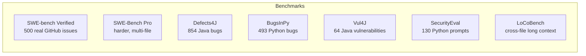

For each benchmark, document: known data leakage rate (BugsInPy 11%, Defects4J 0.41% per leakage analysis), test suite robustness (SWE-Bench Verified inflated by 16%+ per SWE-ABS), what defect classes are covered.

The benchmarks have known limitations:
- SWE-bench scores are inflated by weak tests and solution leakage in issue descriptions (32.67% per SWE-Bench+ analysis).
- Defects4J and BugsInPy are old enough that frontier models likely memorised many solutions.
- None test repair on AI-generated code specifically.

The engine should report scores against these as table stakes, but they should not be the primary signal.

### G.3 Build a custom regression set

The most valuable evaluation asset is a private regression set built from real AI-generated defects. Source material:

- **Vibecoding incident corpus.** Reproduce the publicly documented failures: Lovable RLS bug, Tea Firebase exposure, Base44 missing auth, Enrichlead client-side enforcement, the slopsquatting cases. Each becomes a test case.
- **Synthetic generation.** Prompt frontier LLMs (Claude, GPT, Gemini) with realistic feature requests; collect outputs; have security researchers identify defects; freeze as test cases. Veracode's methodology of 80 curated tasks across 100 LLMs is the model.
- **Dogfooding.** Every defect the engine misses or false-positives in production becomes a regression test.

Target: 500 cases by month 6, 2000 by month 12. Cases evenly distributed across the eight defect classes weighted by observed frequency in production data.

### G.4 A/B testing fix quality

When two repair strategies are candidates (e.g., LLM-A vs LLM-B for Tier 2 patch generation, or codemod vs LLM for ambiguous cases):

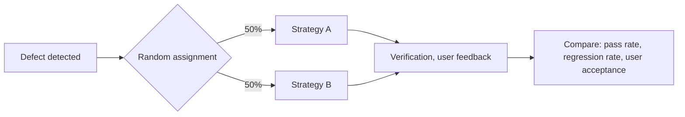

Power consideration: with a 60% acceptance baseline and aiming to detect 5 percentage point lifts, need n ≈ 1500 per arm at 80% power. At launch volumes this is months of data; pre-launch, run on the regression set.

### G.5 Methodology disclosure

Every benchmark and metric the engine publishes should disclose:

- Dataset composition (which benchmarks, ratios)
- Model used at the validator stage and version
- Whether ground truth was human-verified
- Known leakage exposure
- Confidence intervals

This is the methodological gap that makes vendor benchmarks (CodeRabbit, Greptile, Apiiro all guilty) hard to compare. The engine's positioning should be: published methodology, reproducible scores.

---

## Section H: Competitive Landscape

### H.1 Who does what

```mermaid
flowchart TB
    subgraph "Direct competitors: detection + repair"
        A1[Apiiro AI-SAST<br/>Enterprise SAST<br/>$$$$$]
        A2[Snyk DeepCode<br/>Security scan + fix<br/>$$$]
        A3[CodeRabbit<br/>PR review + IDE<br/>$$]
        A4[Greptile<br/>Codebase-aware PR<br/>$$$]
        A5[Cursor BugBot<br/>In-IDE fix loop<br/>$ included]
        A6[Codium / Qodo<br/>AI tests + review<br/>$$]
    end
    subgraph "Adjacent: detection only"
        B1[Semgrep<br/>SAST with AI add-on]
        B2[Veracode<br/>Enterprise SAST]
        B3[ESLint, Ruff, Bandit<br/>Linters]
        B4[GitHub Copilot Review<br/>Diff comments]
    end
    subgraph "Vibecoding hosts: limited safety"
        C1[Lovable, Bolt, Replit]
        C2[Cursor, Windsurf]
    end
```

### H.2 Where each falls short for the vibecoding context

| Tool | Strength | Gap for our use case |
|---|---|---|
| Apiiro AI-SAST | Best-in-class hybrid detection, full software graph | Enterprise-only, expensive, no founder UX, no integration with vibecoding hosts |
| Snyk DeepCode | Strong security focus, mature SCA | Security only; misses logic/performance/architecture; not designed for non-technical users |
| CodeRabbit | Wide adoption, fast IDE feedback, free tier | Diff-only review, doesn't index full codebase, doesn't run sandbox verification, no architectural detection |
| Greptile | Codebase-aware, catches more bugs | Detection-heavy, weaker on repair, no verification loop documented, no founder UX |
| Cursor BugBot | Tight IDE integration, ~80% resolution rate claimed | Locked to Cursor ecosystem, no independent validation, doesn't surface to non-technical users |
| Semgrep | Best precision on classic SAST classes, AI add-on for logic flaws | No repair tier, requires security expertise to configure |
| Veracode | Most credible empirical research, good rule coverage | Enterprise procurement model, no developer or founder UX |
| ESLint/Ruff/Bandit | Free, fast, ubiquitous | No semantic understanding, no AI-specific patterns, no repair beyond simple autofix |
| GitHub Copilot Review | Native to GitHub | Limited rule set, no codebase context, no verification |
| Vibecoding hosts (Lovable etc.) | Owns the deployment surface | Documented track record of shipping critical defects (Lovable CVE-2025-48757, Base44, Tea) |

### H.3 Positioning

The engine's defensible positioning is the intersection that nobody currently serves:

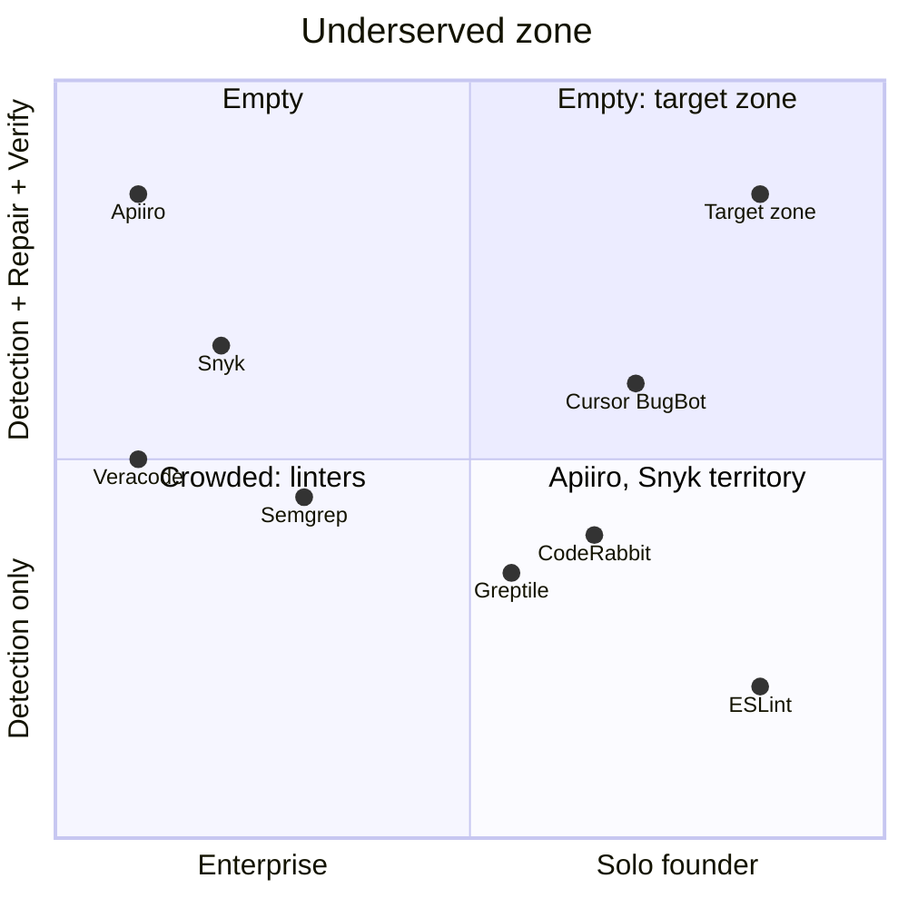

The empty top-right quadrant (solo-founder-friendly + repair-with-verification) is the gap. Nobody competes there because:

- Enterprise tools (Apiiro, Snyk, Veracode) won't simplify; their buyers are CISOs.
- AI review tools (CodeRabbit, Greptile) treat repair as a side feature; their buyers are engineering managers.
- Vibecoding hosts have a financial incentive to claim "your app is fine" rather than admit defects; Lovable's handling of bug bounty reports illustrated this clearly.
- Linters don't do AI-aware patterns.

### H.4 Open source landscape

- **vibe-codebase-audit** and similar repositories collect Semgrep rules and ESLint configs targeting AI-generated patterns. Useful as a starting rule set; not a competitive product.
- **Semgrep-AI** (community fork): wraps Semgrep with local LLM for context validation. Same architecture as Section D.2.3 but DIY. Confirms the architecture pattern is right.
- **Vibe Security Radar** (Georgia Tech): research project, not a tool. Useful as a data source for the regression set.
- **Devin (Cognition)**: agent rather than detector; not directly competitive but the SWE-1.5 model and Cascade harness raise the bar for what "fix this" should feel like.

### H.5 Pricing benchmarks for reference

| Product | Individual | Team | Enterprise |
|---|---|---|---|
| CodeRabbit | $12 to $24/dev/month | per-seat | custom |
| Greptile | not advertised | custom | custom |
| Cursor (incl. BugBot) | $20/month | $40/user/month | custom |
| Snyk Code (DeepCode) | included in $25/user | $25+ | custom |
| Apiiro | not advertised | custom | seven-figure typical |
| Semgrep | free OSS, paid Pro | custom | custom |

Founder-mode pricing should target $10 to $20/month or per-app pricing; team-mode parity with CodeRabbit/Greptile.

---

## Section I: Risk Register

### I.1 Product risks

| Risk | Likelihood | Impact | Mitigation |
|---|---|---|---|
| False sense of security: founder ships because tool said OK, defect was missed | High | Critical | Explicit scope language in UI ("we tested for X categories; here is what we did NOT check"); never use language like "your app is safe"; sandbox probing for the highest-impact classes (auth, RLS) so the no-finding signal has more meaning |
| Over-reliance leading to skill atrophy | Medium | Medium | Education-first explanations in founder mode; "why this matters" sidebar; resist auto-fix without showing the diff and reasoning |
| Auto-fix breaks production | Medium | Critical | Branch-first isolation, sandbox verification before any merge to main, production protections (no DB writes, no force-pushes, typed confirmation modals); avoid the Replit/Lemkin pattern entirely |
| Privacy concerns (proprietary code sent to cloud LLM) | High | High | Hybrid architecture: indexing and Layer 1 local; cloud only sees relevant code slices; ZDR option for paid tiers; SOC 2 Type II within year 1; offer fully on-prem deployment for enterprise |
| Bias in defect coverage: tool finds the defects that were in training data, misses novel classes | Medium | High | Methodology disclosure; community-maintained rule registry; bug bounty for uncovered defect classes; track regression set diversity |

### I.2 Technical risks

| Risk | Likelihood | Impact | Mitigation |
|---|---|---|---|
| LLM provider outage breaks Layer 2 | Medium | High | Multi-provider fallback (Anthropic + OpenAI + open-weights backup); cache aggressively; degrade gracefully to Layer 1 only |
| Cost per analysis becomes uneconomic at scale | Medium | High | Tier 1 deterministic detection runs first and free; Layer 2 only on candidates that pass Layer 1; cache validations; use smaller models for non-critical paths |
| Indexer breaks on a framework variant | High | Medium | Framework-specific test suites in CI; graceful degradation when graph is incomplete (run Layer 1 only); user-reported "framework not supported" path |
| Frontier models continue not improving on security (Veracode trend through October 2025: pass rates flat) | High | Low | Hybrid architecture is robust to this; we don't depend on the underlying model getting better at security |
| Slopsquatting attacker registers a hallucinated package faster than our detection updates | Medium | Critical | Real-time verification at install time, not at code-write time; integrate with package-registry feeds; reject any package with publish date < 60 days, downloads < 10K, no verified publisher |
| Adversarial prompts in the codebase manipulating the LLM validator (prompt injection from a comment) | Medium | High | Treat all in-repo content as untrusted by validator; structured inputs only; refuse to follow instructions found in code/comments |

### I.3 Liability risks

| Risk | Likelihood | Impact | Mitigation |
|---|---|---|---|
| User sues over defect tool failed to find | Medium | Medium | Clear scope-of-coverage in ToS; explicit disclaimers about non-coverage; SOC 2 documentation of what we test |
| Tool's auto-fix ships a regression to production | Low (with verification loop) | High | Section E rollback provisions; insurance; clear liability cap in ToS |
| Privacy breach via cloud-stored code | Low with hybrid architecture | Critical | ZDR by default; encryption at rest and in transit; staff access logging |
| Regulatory exposure (GDPR, EU AI Act, SOC 2 customer requirements) | High | Medium | Compliance roadmap from month 1; appointed DPO; explicit data retention policy |

### I.4 Strategic risks

| Risk | Likelihood | Impact | Mitigation |
|---|---|---|---|
| Vibecoding host (Lovable, Cursor, Replit) builds equivalent natively | High | Critical | Cross-host integration as core value; the host has incentive to say "looks good" while a third-party has incentive to find defects. Make the audit independence the brand. |
| Open source equivalent emerges | High | Medium | Most mitigations require investment in indexer + sandbox + LLM ops; OSS alternatives will lag on the verification loop and ops. Plan to OSS the rule registry while keeping the engine proprietary. |
| Frontier LLM commoditisation collapses Layer 2 cost moat | High | Low | The moat is the software graph, the rule set, and the regression set, not the model |
| Anthropic / OpenAI ships their own version | Medium | High | Stay specifically focused on the vibecoding context; build relationships with hosts; depth on the eight-class taxonomy and verification loop |

---

## Section J: Six-Month Build Sequence

### J.1 Sequencing principle

Build the layers in the order that produces a usable product fastest, then deepen. Layer 1 (deterministic) gives a working product in 6 weeks. Layer 2 (hybrid) is the differentiator. Layer 3 (sandbox) is what separates this from competitors.

### J.2 Milestones

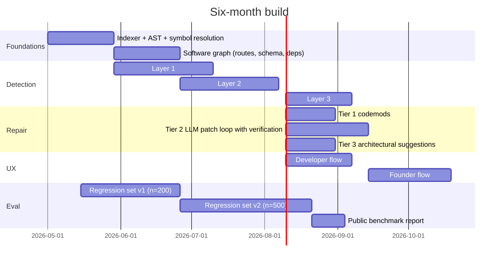

### J.3 Month-by-month plan

#### Month 1: Foundations and Layer 1 detection

- Indexer in TypeScript and Python (tree-sitter based)
- Symbol resolution via TypeScript Language Server and Pyright
- Integrate ESLint, Ruff, Bandit, Semgrep OSS, gitleaks, OSV-scanner as Layer 1
- Define the eight-class defect taxonomy in code (the rule registry)
- First 30 custom Semgrep rules targeting the high-frequency vibecoding patterns
- Regression set v0 (n=50 cases from public incidents)
- **Milestone:** can run on a sample Next.js + Supabase repo, output ranked finding list

#### Month 2: Software graph and Tier 1 repair

- Route inventory for Express, Next.js (App + Pages), FastAPI
- Schema graph for Prisma, Drizzle, Supabase migrations
- Auth model graph: trace authentication and authorisation checks
- First 20 codemods for high-frequency Tier 1 repairs
- jscodeshift and libcst integration
- CLI alpha: `engine check`, `engine fix`
- **Milestone:** end-to-end CLI flow on a test repo, deterministic fixes apply cleanly

#### Month 3: Layer 2 hybrid detection and Tier 2 repair loop

- Validator agent: candidate finding → exploit-trace check → confidence
- Layer 2 detectors for: IDOR, broken access control, missing auth, RLS misconfiguration, business logic
- Tier 2 patch loop: failing test, generate fix, verify, regression check
- Sandbox infrastructure (Modal, Firecracker, or e2b)
- Caching layer: AST cache, graph cache, validation cache
- VSCode plugin alpha
- **Milestone:** hybrid detection of one Lovable-class RLS bug end-to-end, with auto-generated fix that passes verification

#### Month 4: Layer 3 sandbox and developer flow polish

- Build sandbox (full `npm install && npm run build` in container)
- Probe runner: synthesised auth probes against detected routes
- Auto-test generator targeting Layer 2 findings
- PR comment integration: GitHub App, GitLab integration
- Suppression with reason + learning loop
- Regression set v1 (n=200)
- Internal alpha with 3 to 5 design partner customers (mix of solo founders and small teams)
- **Milestone:** can detect and verify the full Lovable / Tea / Base44 / Enrichlead defect set on synthesized reproductions

#### Month 5: Founder flow and host integrations

- Standalone web app for "Check my app" flow
- Plain-English explanation generator
- One-click fix UI with confidence labels and verification trace
- Vibecoding host integrations: Lovable, Bolt, Replit "deploy gate" hooks where APIs allow; otherwise browser-extension fallback
- Block-deploy modal for critical findings
- Tier 3 architectural suggestion presentation
- **Milestone:** founder-mode usability test with 10 non-technical users; measure task success rate

#### Month 6: Hardening, benchmarks, public launch

- Regression set v2 (n=500); achieve target precision/recall
- Public benchmark report against SWE-bench Verified, Defects4J subset, Vul4J subset, custom AI-defect set
- SOC 2 Type II readiness documentation
- ZDR mode for privacy-sensitive customers
- Pricing live: founder mode and team mode tiers
- Launch site, documentation, public methodology disclosure
- **Milestone:** GA with documented metrics, paying customers, regression set published openly

### J.4 Team and resource implications

Reasonable team size and shape:

- 1 tech lead / founding eng
- 2 backend engineers (indexer, graph, detectors)
- 1 ML engineer (Layer 2 validator and repair loop)
- 1 frontend engineer (web app, VSCode plugin)
- 1 security researcher / rule author (custom rules, regression set curation)
- 0.5 design and 0.5 PM

Cost drivers: LLM inference (estimate $0.50 to $2 per repository scan at frontier-model rates with caching); sandbox compute (Modal/Firecracker, $0.10 to $0.50 per scan); fixed engineering payroll.

### J.5 Decision points

The plan has three branch points where data should drive direction:

1. **End of month 2.** Is Layer 1 alone good enough to ship a useful free tier? If yes, ship it; if not, hold launch until Layer 2 is in.
2. **End of month 4.** Is the verification loop's regression rate below 15%? If not, bias toward suggest-only mode rather than auto-apply for Tier 2.
3. **End of month 5.** Founder-mode usability score: above 80% task success? If not, redesign rather than launch.

---

## Appendix: Sources and Confidence Notes

### Primary sources (high confidence, methodology disclosed)

- Veracode 2025 GenAI Code Security Report (45% vulnerability rate across 100+ LLMs, 80 tasks)
- Veracode October 2025 update (per-model pass rates: GPT-5 70%, Claude Sonnet 4.5 50%, Gemini 2.5 Pro 59%)
- CodeRabbit State of AI vs Human Code Generation (December 2025, 470 PRs, 1.7x defect rate)
- Apiiro 4x Velocity, 10x Vulnerabilities (September 2025; tens of thousands of repos, Fortune 50)
- Pearce et al, Asleep at the Keyboard: Copilot security study (40% vulnerable suggestions)
- Liu et al, Security Weaknesses of Copilot-Generated Code in GitHub Projects (35.8% of snippets contain CWEs, 43 categories; ACM TOSEM 2025)
- Spracklen et al, We Have a Package for You! Comprehensive Analysis of Package Hallucinations (19.7% hallucination rate, 205,474 unique fake names; arXiv 2406.10279)
- Al-Maamari, Why LLMs Fail: Failure Analysis for Automated Security Patch Generation (24.8% full-correctness rate on Vul4J)
- Camporese & Massacci, Repairing Vulnerabilities Without Invisible Hands (replication with localisation offsets)
- METR, Measuring the Impact of Early-2025 AI on Experienced Open-Source Developer Productivity (19% slowdown, n=16, RCT)
- Georgia Tech SSLab Vibe Security Radar (74 confirmed AI-attributed CVEs as of April 2026, methodology open-sourced)
- Semgrep AI-powered detection benchmarks (61% precision on IDOR vs 22% Claude alone, 1.9x recall)
- Semgrep Assistant 96% triage agreement with security researchers
- SWE-bench / SWE-Bench Pro / SWE-ABS / UTBoost (rigorous evaluation papers documenting benchmark inflation)

### Secondary sources (medium confidence; useful for sentiment, UX, vendor positioning)

- Apiiro AI-SAST product announcement (December 2025)
- CodeRabbit blog and product announcements
- Greptile vs CodeRabbit comparison benchmarks (vendor-published, treat directionally)
- Lovable, Tea, Base44, Enrichlead, Replit incident reports (multiple secondary sources; underlying facts verified across sources)
- JetBrains January 2026 developer survey (IDE adoption)

### Confidence flags

- **Frequency claims:** anchored to at least one primary source for each. Where vendor claims (Apiiro 10x) are disputed, both sides cited.
- **Repair regression rates (10 to 50%):** specific Vul4J number is rigorous; broader range relies on cross-vendor commentary and is directional.
- **Vibecoding incident timeline:** documented across multiple sources; specific user counts and CVE assignments verified against NVD/GHSA.
- **Tool benchmark scores (44%/82% bug detection):** vendor-disclosed; treat as upper bound for marketing context, lower bound for adversarial cases.

### Out-of-scope confirmations

This report does not cover:
- Generic linting outside AI-generated patterns
- Theoretical program analysis
- Vendor-locked enterprise solutions
- Future model capabilities beyond what is shipping in May 2026

---

**End of specification.**
